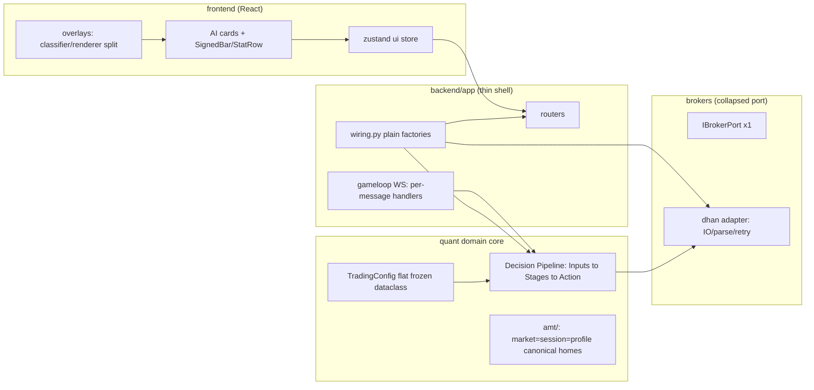
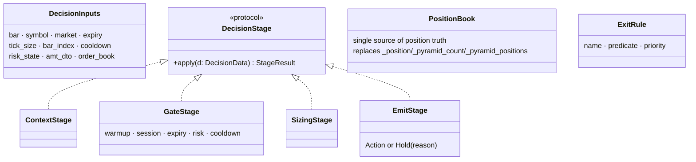

# Refactoring Design — GlassyTrade AI (stable_7)

<!-- Target architecture -->


<!-- Decision pipeline (WS2) -->


**Date:** 2026-08-25 · **Status:** PROPOSED — awaiting user approval
**Basis:** `docs/audit/COMPLEXITY_OVERENGINEERING_AUDIT_2026-08-25.md` (both passes, all claims source-verified)
**Approach:** Strangler refactor (Option B). Behavior-preserving extractions, each gated by golden-output tests. No big-bang rewrite of a real-money system. Infrastructure flattens toward the single-strategy, single-broker reality.
**Plan granularity:** this document is the program design. Each workstream gets its own implementation plan (writing-plans) before any code changes.

---

## Workstreams

| WS | Name | Fixes | Est. deletion | Risk |
|---|---|---|---|---|
| Quick wins | Dead code + hygiene batch | LiveOMS, SessionPhase enum, `__del__`, async_boundary shim, AggressivePrintRegistry | ~400 LOC | Low |
| WS1 | Config flattening | OE1: 1,475-LOC config stack; `validate_config` (CC 63 / COG 98) | ~1,000 LOC | Low-Med |
| WS2 | Decision pipeline decomposition | `context_builder.build` COG 132; `exits.evaluate` COG 119/16 params; `_decide` 42; gate exception swallowing; position triple-state; 18-param `analyze` | — | Med |
| WS3 | Quant module dedup + AMTAnalyzer split | duplicate displacement/structure/npoc/compute/context pairs; 1,033L god object | ~600 LOC | Med |
| WS4 | Broker port collapse | dual abstraction (~1,000 LOC translation); `get_option_chain_async` COG 111; converters.py 821L | ~800 LOC | Med-High |
| WS5 | Frontend render primitives | CC hotspots 74/69/59/36×2 in cards+overlays | ~300 LOC | Low |
| WS6 | Wiring replaces DI container | container.py 157L + composition_root 166L for static graph | ~250 LOC | Low |
| WS7 | LLM excision from hot path | daemon thread + MLX + queue inside `_decide` (`runtime.py:268`) | ~200 LOC decoupled | Low |
| WS8 | Typed WS contract | untyped delta merge → silent corruption; mega-hook split | — | Low-Med |
| WS9 | Concurrency consolidation (SPIKE ONLY) | thread-per-symbol + 5-lock hierarchy | lock hierarchy | High — time-boxed spike before commit |

## Sequencing

```
quick wins + WS7 → WS5 + WS8 → WS1 → WS6 → WS2 (golden traces) → WS3 → WS4 → WS9 (spike)
```

Rationale:
- Quick wins + WS7 remove real-money risk surface immediately (LLM hang can block decision thread)
- WS8 freezes the frontend contract BEFORE frontend refactors, so later backend renames fail loudly
- WS2 runs only behind golden-trace replay safety net
- WS4 after WS2 because pipeline tests provide the behavioral oracle for port collapse
- WS9 stays spike-gated: largest payoff, largest blast radius

## Current Baseline (measured 2026-08-25)

- Backend suite: 1,169 collected · `not e2e and not live`: **1,162 passed / 2 failed / 4 skipped** (3m47s)
  - `tests/integration/test_fabio_india_scenarios.py::test_scenario_midday_blocks_trend_continuation` — **deterministic failure (reproduces 4/4)**. Scenario expects trend continuation blocked at midday; current code approves (`approved=True`, "All 4 gates passed"). Pre-existing behavioral gap, unrelated to any refactor. ⚠️ Must be triaged BEFORE WS2: golden-trace replay must not enshrine wrong behavior as "expected"
  - `tests/quant/test_property_based.py::test_vah_always_geq_val` — hypothesis deadline flake under full-suite load only; passes 5/5 in isolation
- Frontend runner: vitest (`npm run test`), suite exists under frontend/tests/
- Gate for every refactor commit: same command green at ≤ these 2 known failures

## Per-Workstream Safety Protocol (backend)

1. Capture golden decision traces from the current build: a recording wrapper around `QuantEngine._decide` and `ExitEngine.evaluate` run against recorded paper-replay sessions writes JSONL of `(inputs_hash, symbol, bar_index) -> action`
2. Extract/refactor
3. Replay traces through the refactored code; any diff blocks the commit
4. Full test suite green
5. Commit as one atomic step

Frontend steps use visual-parity checks instead.

## Key Designs (diagrams were presented and discussed in session)

- **WS1:** frozen `TradingConfig` assembled by per-section parsers; unknown keys rejected at parse; validation collapses into construction
- **WS2:** `DecisionInputs` struct → Context/Gate/Sizing/Emit stages over shared blackboard; exits become ordered rule list `(name, predicate, priority)`; exceptions never masquerade as rejects (propagate to halt/alarm); `PositionBook` value object replaces triple-state; `AnalysisInputs` struct for analyzer
- **WS3:** canonical homes — `market/`=pure detection primitives, `session/`=time-boxed state, `profile/`=delegating views, `contracts/ports/`=Protocols only; AMTAnalyzer becomes pure stage chain `(AMTState) → AMTState`
- **WS4:** one `IBrokerPort`, Dhan implements directly; IO/parsing/retry separated; retry table-driven; converters shrink to genuine mapping
- **WS5:** `SignedBar`/`StatRow` primitives + tone helper; overlays split classifier/renderer
- **WS6:** `wiring.build_app_context() -> AppContext` plain factories, no scopes/runtime resolution
- **WS7:** engine deterministic; LLM advisory moves to offline journal analysis (separate process) or is deleted outright
- **WS8:** `schema/ws_messages.json` single source of truth → generated pydantic models + generated TS types + runtime validator; parse-or-reject whole message
- **WS9 (spike):** measure one asyncio loop vs thread-per-symbol tick throughput; fallback = keep threads but serialize order mutations through one executor

## Explicitly Out of Scope

- Any behavior change to entry/exit logic beyond structural equivalence
- New features riding the refactor
- Multi-broker or multi-strategy generality (the reason the flattening is safe)

## Open Decisions Requiring User Input

1. LiveOMS: delete, or wire properly if live trading via real OMS is imminent?
2. WS7: delete LLM advisory entirely, or keep it as offline post-session journal analysis?
3. WS9: run the spike at all this cycle, or defer?
