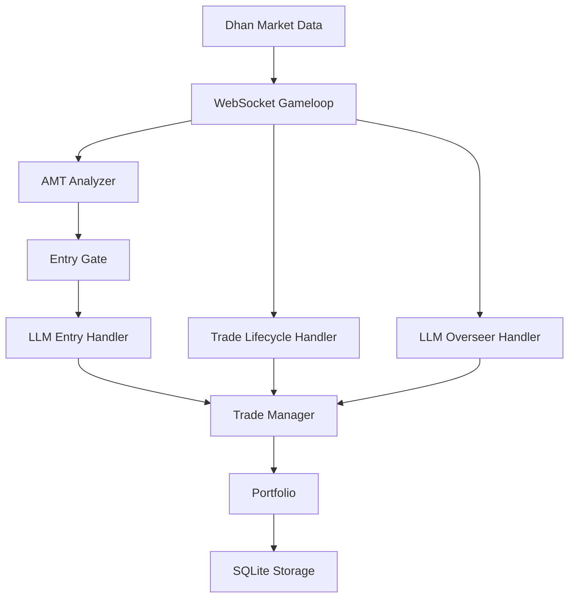
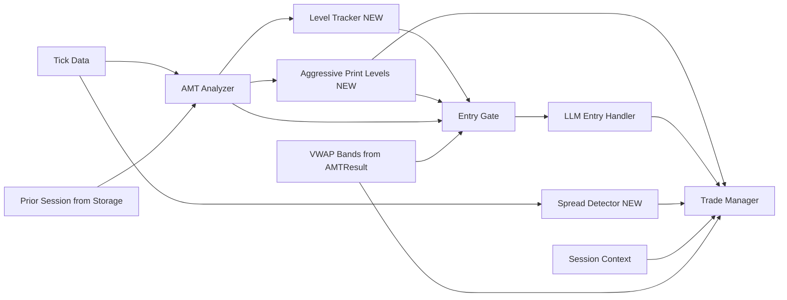

# Design Document: GlassyTrade AI v5 Improvements

## Overview

This document details 10 improvements to the GlassyTrade AI v5 trading system, prioritized per Fabio's review. The theme is **defense before offense**: fix exits (breakeven, time stops, spread detection), improve entry quality (second drive, VWAP, aggressive prints), then enrich context (overseer, prior session, LLM tuning).

All changes are backward-compatible. New config fields have defaults preserving current behavior. Each item is independently implementable.

---

## Architecture

### System Architecture (Current)



### Data Flow (Post-Improvements)



---

## Dependency Graph

```
No dependencies (parallel):
  [1] Breakeven at 1R
  [3] Session-Aware Time Stops
  [7] Spread Blowout Detection
  [9] Prior Session Data Flow
  [10] LLM Instruction + Temperature

Depends on nothing but benefits from [1]:
  [4] VWAP Bands (trailing interacts with BE logic)
  [5] Overseer Context Enrichment
  [6] Aggressive Prints as Structural Levels

Depends on [6] Aggressive Prints:
  [2] Second Drive Enforcement (uses structural levels including aggressive prints)

Depends on [6] + [5]:
  [8] Volume Bubble Integration (wires footprint into entry gate + overseer + trade manager)
```

---

## Batch Plan

| Batch | Items | Rationale |
|-------|-------|-----------|
| **Batch 1** | [1] Breakeven, [3] Time Stops, [7] Spread Detection, [10] LLM Tuning | All independent, all SMALL. Pure defense. No new data structures. |
| **Batch 2** | [4] VWAP Bands, [6] Aggressive Prints, [9] Prior Session | Entry quality + data plumbing. VWAP needs BE done first to avoid trailing conflict. |
| **Batch 3** | [2] Second Drive, [5] Overseer Enrichment, [8] Volume Bubbles | Structural changes that build on Batch 2 levels and data. |

---

## Item 1: Breakeven at 1R / CVD-Based

### Current Behavior

`TradeManager.check_position()` (trade_manager.py:324-340) moves SL to breakeven only when unrealized profit reaches `partial_tp_pct * tp_distance` (50% of TP). Trail activation also uses `trail_activation_pct = 0.50` (line 36). This is too slow -- reversals turn scratches into full stops.

### Target Behavior

1. Move SL to breakeven when unrealized profit reaches 1R (distance from entry to initial stop).
2. Move SL to breakeven when CVD confirms trade direction within 1 candle of entry (regardless of profit distance).
3. Whichever triggers first wins.
4. Trail activation at 1R distance instead of 50% TP.
5. SL must never move below breakeven once set there.

### API/Interface Changes

```python
# TradeManagerConfig additions
@dataclass
class TradeManagerConfig:
    ...
    breakeven_at_1r: bool = True          # NEW: enable 1R breakeven
    cvd_breakeven: bool = True            # NEW: enable CVD-based breakeven
    trail_activation_r: float = 1.0       # NEW: trail activates at 1R (replaces trail_activation_pct for this purpose)

# ManagedPosition additions
@dataclass
class ManagedPosition:
    ...
    breakeven_set: bool = False           # NEW: tracks if BE has been applied
    entry_cvd_direction: str = ""         # NEW: "BULLISH" or "BEARISH" - set at registration

# TradeManager new method
def apply_cvd_breakeven(self, position_id: str, cvd_slope: float) -> bool:
    """Move to breakeven if CVD confirms direction within grace period."""
```

### Data Flow

```
check_position(pos_id, price)
  |
  +-- [after SL check, before partial TP check]
  |   if not mp.breakeven_set:
  |     risk = abs(entry - initial_stop)
  |     unrealised >= risk? --> move SL to entry, set breakeven_set=True
  |
  +-- [partial TP check]: skip if breakeven_set (already at BE)
  |   existing partial TP logic still fires at partial_tp_pct for the actual partial close
  |
  +-- [trailing]: use 1R as activation threshold instead of 50% TP

apply_cvd_breakeven(pos_id, cvd_slope) -- called from gameloop tick
  |
  +-- if tick_count <= candles_per_confirmation (e.g., 1-2 ticks)
  |     and cvd confirms direction (LONG+positive slope, SHORT+negative)
  |     --> move SL to entry, set breakeven_set=True
```

### Files Modified

- `backend/app/domain/fabio_ai/services/trade_manager.py` -- BE logic in `check_position`, new `apply_cvd_breakeven`, config fields
- `backend/app/application/handlers/trade_lifecycle_handler.py` -- call `apply_cvd_breakeven` with CVD data from AMTResult
- `backend/app/api/websocket/gameloop.py` -- pass `cvd_slope` to lifecycle handler (if not already available)

### Test Strategy

- Unit: position reaches 1R --> SL moves to entry price
- Unit: CVD confirms within 1 candle --> SL moves to entry price
- Unit: SL never moves below entry once breakeven_set=True
- Unit: partial TP still fires at correct distance (no regression)
- Unit: trailing activates at 1R, not 50% TP
- Edge: tight SL (1.5% floor) with wide spread -- does BE trigger excessive BE-outs?
- Edge: CVD fires, next candle is doji -- position holds at BE

### Risk/Rollback

**Risk**: On tight stops, 1R may be very close to entry, causing premature BE-outs on normal retraces. Mitigation: CVD confirmation as secondary -- only apply 1R BE if CVD also slightly confirms (slope > 0 for LONG).

**Rollback**: Set `breakeven_at_1r = False` and `cvd_breakeven = False` in config to revert to old behavior.

---

## Item 2: Second Drive Enforcement

### Current Behavior

`entry_gate.py:three_align_check()` (lines 25-71) checks if price is near a level (VAH/VAL/POC/HVN/LVN/IB) but does not distinguish first touch from second touch. All touches are weighted equally. First touches have lower win rate per AMT methodology.

### Target Behavior

1. Track touches at levels with timestamps.
2. "Second drive" = price leaves by 1 ATR and returns within proximity zone (0.2-0.3% of price).
3. Second drive adds +2 to grade_score in `llm_entry_handler.py` grading logic (line 366).
4. First touch applies -1 penalty.
5. 3+ touches = "exhausted", -2 penalty.
6. Intraday touches cleared on session start; structural levels retained.

### API/Interface Changes

```python
# NEW file: backend/app/domain/fabio_ai/services/level_tracker.py

@dataclass
class TrackedLevel:
    price: float
    source: str          # "VAH", "VAL", "POC", "HVN", "LVN", "AGGRESSIVE_PRINT"
    touches: list[float] # timestamps
    max_pullback: float   # largest distance price moved away after touch
    status: str           # "FIRST_TOUCH", "SECOND_DRIVE", "EXHAUSTED"

class LevelTracker:
    def __init__(self, proximity_pct: float = 0.003, pullback_atr_mult: float = 1.0):
        ...

    def update(self, price: float, timestamp: float, atr: float) -> None:
        """Call every tick. Updates touch counts and pullback tracking."""

    def register_levels(self, levels: list[tuple[float, str]]) -> None:
        """Register structural levels from AMT (called when AMT updates)."""

    def get_level_status(self, price: float) -> tuple[str, str] | None:
        """Returns (status, source) for the nearest level, or None."""

    def clear_intraday(self) -> None:
        """Clear intraday touches, keep structural levels."""
```

### Data Flow

```
AMT Analyzer produces levels
  |
  v
LevelTracker.register_levels([VAH, VAL, POC, HVNs, LVNs, AggressivePrints])
  |
  v (every tick)
LevelTracker.update(price, timestamp, atr)
  |
  v (on LLM entry)
LevelTracker.get_level_status(price)
  |
  v
LLMEntryHandler grading: grade_score += {SECOND_DRIVE: +2, FIRST_TOUCH: -1, EXHAUSTED: -2}
```

### Files Modified

- **NEW**: `backend/app/domain/fabio_ai/services/level_tracker.py` -- LevelTracker class
- `backend/app/application/handlers/llm_entry_handler.py` -- inject LevelTracker, add to grading (around line 366)
- `backend/app/api/websocket/gameloop.py` -- instantiate LevelTracker, call `update()` per tick, call `register_levels()` after AMT
- `backend/app/application/services/trading_session.py` -- hold LevelTracker instance

### Test Strategy

- Unit: first touch at level --> status = "FIRST_TOUCH"
- Unit: price leaves by 1 ATR, returns --> status = "SECOND_DRIVE"
- Unit: 3 touches --> status = "EXHAUSTED"
- Unit: grade_score modification is correct (+2, -1, -2)
- Unit: proximity zone uses 0.2-0.3% (not exact match)
- Unit: `clear_intraday()` resets touches but keeps level registrations
- Edge: retest 5 ticks below original (within proximity) counts as second drive

### Risk/Rollback

**Risk**: If proximity zone is too wide, everything becomes "second drive." If too strict, second drives are never detected. Use 0.3% of price as default, configurable.

**Rollback**: Remove LevelTracker from grading; grade_score reverts to current logic (no touch-based adjustment).

---

## Item 3: Session-Aware Time Stops

### Current Behavior

`TradeManager.check_position()` (trade_manager.py:403-427) uses static time stops:
- `max_hold_seconds = 1800` (30 min) for BALANCED
- `7200` (2 hr) for IMBALANCED

No session phase awareness. No expiry day handling. A 2-hour hold on expiry day in balanced market bleeds 30-40% of premium to theta.

### Target Behavior

| Session Phase | Market State | Time Stop |
|---|---|---|
| Morning (Phase 2: 09:30-11:30) | BALANCED | 20 min (1200s) |
| Morning (Phase 2: 09:30-11:30) | IMBALANCED | 45 min (2700s) |
| Afternoon (Phase 4: 14:00-15:15) | BALANCED | 15 min (900s) |
| Afternoon (Phase 4: 14:00-15:15) | IMBALANCED | 30 min (1800s) |
| Expiry Day | BALANCED | 10 min (600s) |
| Expiry Day | IMBALANCED | 20 min (1200s) |
| Midday (Phase 3: 11:30-14:00) | Any | 15 min (900s) |
| Fallback (no session data) | BALANCED | 1800s (current) |
| Fallback (no session data) | IMBALANCED | 7200s (current) |

Additional rule: `time_stop = min(session_time_stop, time_to_close - 300)` (always exit 5 min before session close).

If market transitions from BALANCED to IMBALANCED during a trade, extend forward (never shorten retroactively).

### API/Interface Changes

```python
# TradeManager new method
def get_session_time_stop(
    self, market_state: str, session_phase: str, is_expiry: bool,
    time_to_close_seconds: float | None = None,
) -> float:
    """Return time stop in seconds based on session context."""

# ManagedPosition additions
@dataclass
class ManagedPosition:
    ...
    session_phase: str = ""               # NEW: set at registration
    is_expiry_day: bool = False           # NEW: set at registration
    time_to_close: float = 0.0           # NEW: seconds until session close
    applied_time_stop: float = 0.0       # NEW: the time stop that was applied (only extends, never shrinks)
```

### Data Flow

```
register_position(..., session_phase, is_expiry_day, time_to_close)
  |
  v
check_position():
  time_stop = get_session_time_stop(market_state, session_phase, is_expiry)
  time_stop = min(time_stop, time_to_close - 300) if time_to_close > 0
  applied_time_stop = max(applied_time_stop, time_stop)  # only extends
  if (now - entry_time) >= applied_time_stop: exit
```

### Files Modified

- `backend/app/domain/fabio_ai/services/trade_manager.py` -- `get_session_time_stop()`, modify `check_position()` time stop section, add fields to `ManagedPosition`
- `backend/app/application/handlers/trade_lifecycle_handler.py` -- pass `session_phase`, `is_expiry_day`, `time_to_close` to `register_position()`
- `backend/app/domain/fabio_ai/services/session_context.py` -- add `is_expiry_day(date)` helper and `seconds_to_close(timestamp, market)` helper
- `backend/app/api/websocket/gameloop.py` -- compute and pass expiry/close info

### Test Strategy

- Unit: morning balanced --> 1200s time stop
- Unit: afternoon imbalanced --> 1800s time stop
- Unit: expiry day balanced --> 600s time stop
- Unit: enter at 14:55, close at 15:15 --> time_stop = min(phase_stop, 20min - 5min = 15min)
- Unit: market transitions BALANCED -> IMBALANCED mid-trade --> time stop extends, does not shorten
- Unit: no session data --> fallback to current 1800/7200
- Regression: existing time stop tests still pass with default config

### Risk/Rollback

**Risk**: Too aggressive time stops cut winners short in trending sessions. Mitigation: IMBALANCED gets longer stops, and `applied_time_stop` only extends.

**Rollback**: Set all time stop values to current defaults (1800/7200) in a config lookup table.

---

## Item 4: VWAP Bands for Bias and Trailing

### Current Behavior

VWAP bands are already computed in AMTResult (`vwap_upper_1`, `vwap_lower_1`, `vwap_upper_2`, `vwap_lower_2` -- value_objects.py:81-85). They are included in the overseer prompt (prompt_builder.py:514-519) as simple above/below VWAP text. They are NOT used for:
- Entry bias filtering
- Dynamic trailing

### Target Behavior

1. LONG below VWAP --> warning flag in signal metadata (soft filter, not hard block).
2. Price at VWAP +/- 2 sigma --> downgrade confidence by 1 level.
3. At +1.5R profit --> trail SL to nearest VWAP band.
4. Price at VWAP + 2 sigma (LONG) or VWAP - 2 sigma (SHORT) --> tighten SL to 50% of current distance.

### API/Interface Changes

```python
# entry_gate.py -- new function
def check_vwap_bias(direction: str, price: float, vwap: float, vwap_upper_2: float, vwap_lower_2: float) -> dict:
    """Returns {"warning": bool, "overextended": bool} for entry bias."""

# TradeManager -- new method
def apply_vwap_trail(
    self, position_id: str, current_price: float,
    vwap: float, vwap_upper_1: float, vwap_lower_1: float,
    vwap_upper_2: float, vwap_lower_2: float,
) -> None:
    """Trail to nearest VWAP band at 1.5R, tighten at 2 sigma."""
```

### Data Flow

```
Entry path:
  LLMEntryHandler grading
    |
    v
  check_vwap_bias(direction, price, vwap, vwap_upper_2, vwap_lower_2)
    |
    v (if overextended)
  confidence downgrade by 1 level
    |
    v (if warning)
  signal.metadata["vwap_warning"] = True

Exit/trail path:
  trade_lifecycle_handler.check_exits()
    |
    v (every tick)
  trade_manager.apply_vwap_trail(pos_id, price, vwap bands from AMTResult)
    |
    v
  At 1.5R: trail SL to nearest VWAP band
  At 2 sigma: tighten SL to 50% of current distance
  Cap trail distance: max(VWAP band, 1.5R) -- prevents too-loose trails in high vol
```

### Files Modified

- `backend/app/domain/fabio_ai/services/entry_gate.py` -- add `check_vwap_bias()`
- `backend/app/domain/fabio_ai/services/trade_manager.py` -- add `apply_vwap_trail()`
- `backend/app/application/handlers/llm_entry_handler.py` -- call `check_vwap_bias()` in grading, add metadata
- `backend/app/application/handlers/trade_lifecycle_handler.py` -- call `apply_vwap_trail()` per tick with AMTResult bands

### Test Strategy

- Unit: LONG below VWAP --> warning flag set
- Unit: SHORT above VWAP --> warning flag set
- Unit: price at VWAP+2sigma LONG entry --> confidence downgraded
- Unit: at 1.5R profit --> SL moved to nearest VWAP band
- Unit: at 2 sigma overextension --> SL tightened to 50% distance
- Unit: high-vol session where VWAP bands are wide --> trail capped at 1.5R

### Risk/Rollback

**Risk**: VWAP bands can be wide in high-volatility sessions, making trail too loose. Mitigation: cap trail distance at `max(VWAP_band_distance, 1.5R)`.

**Rollback**: Remove `apply_vwap_trail()` calls from lifecycle handler. Remove `check_vwap_bias()` from grading.

---

## Item 5: Overseer Context Enrichment

### Current Behavior

`build_overseer_prompt()` (prompt_builder.py:453-539) includes: position state, market state, VP levels, delta, CVD, aggressive prints, VWAP, exit probability. It does NOT include:
- Session phase (London/NY/NSE phases)
- Volume profile shape (P/b/D)
- OI/PCR data
- LVN play signals
- Stacked imbalances from footprint

### Target Behavior

Add all five missing data sources to the overseer prompt. If any source is unavailable, omit gracefully.

### API/Interface Changes

```python
# build_overseer_prompt signature change
def build_overseer_prompt(
    pos_state: dict,
    tick: OHLC,
    amt_result: AMTResult,
    session_info: SessionInfo | None = None,      # NEW
    footprint_candle: FootprintCandle | None = None,  # NEW
    oi_analysis: dict | None = None,              # NEW
) -> str:
```

### Data Flow

```
LLMOverseerHandler.run_overseer(session, symbol, tick, amt_result)
  |
  v
  session_info = get_session_info(tick.time, ...)
  footprint = session.last_footprint_candle  (if available)
  oi = session._oi_analysis  (if available)
  |
  v
  build_overseer_prompt(pos_state, tick, amt_result, session_info, footprint, oi)
  |
  v  (in prompt_builder.py, append sections)
  "Session: NSE_PRIMARY (Phase 2). Favor trend continuation."
  "Profile shape: b-shape (buying absorption)."
  "OI: LONG_BUILD. PCR: 1.25."
  "LVN PLAY: LONG at 24750 ..."
  "Stacked imbalances: 3 consecutive BUY imbalances at 24780-24800."
```

### Files Modified

- `backend/app/domain/fabio_ai/services/prompt_builder.py` -- extend `build_overseer_prompt()` signature and body
- `backend/app/application/handlers/llm_overseer_handler.py` -- pass `session_info`, `footprint`, `oi` to `build_overseer_prompt()`

### Test Strategy

- Unit: prompt includes session phase when provided
- Unit: prompt includes profile shape when AMTResult has it
- Unit: prompt includes OI/PCR when provided
- Unit: prompt includes LVN play when AMTResult has it
- Unit: prompt includes stacked imbalances when footprint has them
- Unit: each source missing --> prompt still valid, no crash
- Regression: existing overseer parse tests still pass

### Risk/Rollback

**Risk**: Prompt becomes too long, exceeding max_tokens for context. Mitigation: keep each section to 1 line.

**Rollback**: Revert `build_overseer_prompt()` to current 2-argument signature.

---

## Item 6: Aggressive Prints as Structural Levels

### Current Behavior

Aggressive prints (2.5 sigma volume spikes) are detected in AMTAnalyzer and stored in `AMTResult.aggressive_prints` as `AggressivePrint` objects. They expire after 30 candles. They are used for:
- SL placement (`sl_from_aggressive_print` in entry_gate.py:264-283)
- Display in volume bubble summary in LLM prompt

They are NOT used as structural levels for:
- Near-level checks in three_align_check (entry_gate.py:48-68)
- Dynamic SL anchoring in TradeManager

### Target Behavior

1. Register aggressive print prices as structural levels in `three_align_check()` near-level search.
2. Anchor dynamic SL to nearest aggressive print if it provides tighter risk.
3. Expire after 30 candles (existing behavior).
4. Cluster prints within 0.1% into single level at volume-weighted average.

### API/Interface Changes

```python
# entry_gate.py -- modify three_align_check to accept aggressive_print_levels
def three_align_check(
    data: list[OHLC],
    amt_result: AMTResult,
    tick: OHLC,
    order_book=None,
    ib_high: float = 0.0,
    ib_low: float = 0.0,
    aggressive_levels: list[float] | None = None,  # NEW
) -> bool:

# NEW utility in entry_gate.py
def cluster_aggressive_prints(prints: tuple[AggressivePrint, ...], cluster_pct: float = 0.001) -> list[float]:
    """Cluster prints within cluster_pct of each other, return VWAP of each cluster."""
```

### Data Flow

```
AMTResult.aggressive_prints
  |
  v
cluster_aggressive_prints(prints) --> [level1, level2, ...]
  |
  v
three_align_check(..., aggressive_levels=[level1, level2])
  |  (adds to near_level search loop)
  v
build_entry_signal(): sl_from_aggressive_print() already works
  |
  v
TradeManager: if aggressive level provides tighter SL, use it
  (via check_position or a new adjust method)
```

### Files Modified

- `backend/app/domain/fabio_ai/services/entry_gate.py` -- add `cluster_aggressive_prints()`, add aggressive_levels to `three_align_check()`
- `backend/app/application/handlers/llm_entry_handler.py` -- compute clustered levels, pass to gate
- `backend/app/api/websocket/gameloop.py` -- pass aggressive_levels through to entry handler

### Test Strategy

- Unit: `cluster_aggressive_prints()` merges prints within 0.1%
- Unit: `three_align_check()` recognizes price near aggressive print as "near level"
- Unit: existing near-level checks still work (VAH/VAL/POC/HVN/LVN)
- Unit: prints older than 30 candles excluded from clustering
- Edge: many prints --> cap at top 5 by volume

### Risk/Rollback

**Risk**: Too many aggressive print levels make "near level" always true, rendering the gate meaningless. Mitigation: cap at top 5 levels by volume.

**Rollback**: Pass `aggressive_levels=None` to `three_align_check()`.

---

## Item 7: Spread Blowout Detection

### Current Behavior

`check_confirmation_bundle()` (entry_gate.py:78-111) checks spread at entry time (spread_bps <= 5.0). No spread monitoring during an open position. In Indian options, spreads can blow out 5-10x during volatility events, eating profits on exit.

### Target Behavior

1. On every tick while a position is open, check if bid-ask spread exceeds 3% of premium.
2. If spread blowout detected, immediately trigger FULL_EXIT.
3. Log the event for analysis.

### API/Interface Changes

```python
# TradeManager new method
def check_spread_blowout(
    self, position_id: str, best_bid: float, best_ask: float,
    premium: float, max_spread_pct: float = 0.03,
) -> ExitSignal | None:
    """Exit immediately if spread exceeds max_spread_pct of premium."""

# New ExitReason
class ExitReason:
    ...
    SPREAD_BLOWOUT = "SPREAD_BLOWOUT"  # NEW
```

### Data Flow

```
Gameloop tick
  |
  v
order_book.bids[0].price, order_book.asks[0].price
  |
  v
trade_lifecycle_handler.check_spread_blowout(pos_id, bid, ask, premium)
  |
  v (if spread > 3% of premium)
  ExitSignal(SPREAD_BLOWOUT) --> close position immediately
```

### Files Modified

- `backend/app/domain/fabio_ai/services/trade_manager.py` -- add `check_spread_blowout()`, add `SPREAD_BLOWOUT` to ExitReason
- `backend/app/application/handlers/trade_lifecycle_handler.py` -- call `check_spread_blowout()` in `check_exits()` before other checks
- `backend/app/api/websocket/gameloop.py` -- pass order book data to lifecycle handler

### Test Strategy

- Unit: spread < 3% --> no exit
- Unit: spread >= 3% --> SPREAD_BLOWOUT exit
- Unit: no order book data --> skip check (no crash)
- Unit: ExitReason.SPREAD_BLOWOUT is tracked correctly
- Edge: spread exactly at 3% threshold

### Risk/Rollback

**Risk**: False triggers during normal spread widening (e.g., market open). Mitigation: only check after grace period (tick_count >= 5, same as time stop).

**Rollback**: Remove `check_spread_blowout()` call from lifecycle handler.

---

## Item 8: Volume Bubble Integration

### Current Behavior

Three separate bubble detection systems exist:
1. `AMTResult.aggressive_prints` -- 2.5 sigma volume spikes from AMTAnalyzer
2. `FootprintAnalyzer` -- stacked imbalances (`FootprintLevel.stacked`)
3. Tick accumulator in gameloop

These are not unified. Stacked imbalances from footprint are NOT fed to EntryGate or TradeManager.

### Target Behavior

1. Propagate stacked imbalances from FootprintAnalyzer to EntryGate, PromptBuilder, and TradeManager.
2. Stacked imbalances align with entry direction --> +1 grade_score.
3. Stacked imbalances oppose entry direction --> -2 grade_score.
4. Stacked imbalances oppose open position --> TIGHTEN action.
5. Overseer prompt includes imbalances with direction and magnitude.

### API/Interface Changes

```python
# NEW value object
@dataclass(frozen=True)
class StackedImbalance:
    direction: str       # "BUY" or "SELL"
    price_low: float
    price_high: float
    magnitude: int       # number of consecutive imbalance levels
    candle_time: str

# entry_gate.py
def check_imbalance_alignment(direction: str, imbalances: list[StackedImbalance]) -> int:
    """Returns grade_score adjustment: +1 if aligned, -2 if opposing."""

# TradeManager
def check_imbalance_tighten(
    self, position_id: str, imbalances: list[StackedImbalance], current_price: float,
) -> bool:
    """Tighten SL if imbalances oppose position. Returns True if tightened."""
```

### Data Flow

```
FootprintAnalyzer.generate(data)
  |
  v
Extract stacked imbalances from FootprintCandle.levels where .stacked == True
  |
  v
StackedImbalance objects (direction inferred from delta sign)
  |
  +---> EntryGate grading: check_imbalance_alignment()
  +---> build_overseer_prompt(): include in prompt text
  +---> TradeManager: check_imbalance_tighten()
```

### Files Modified

- `backend/app/domain/trading/models/value_objects.py` -- add `StackedImbalance` dataclass
- `backend/app/domain/fabio_ai/services/footprint_analyzer.py` -- add method to extract `StackedImbalance` list from `FootprintCandle`
- `backend/app/domain/fabio_ai/services/entry_gate.py` -- add `check_imbalance_alignment()`
- `backend/app/domain/fabio_ai/services/trade_manager.py` -- add `check_imbalance_tighten()`
- `backend/app/domain/fabio_ai/services/prompt_builder.py` -- include imbalances in overseer prompt
- `backend/app/application/handlers/llm_entry_handler.py` -- call `check_imbalance_alignment()` in grading
- `backend/app/application/handlers/trade_lifecycle_handler.py` -- call `check_imbalance_tighten()`
- `backend/app/api/websocket/gameloop.py` -- extract and propagate StackedImbalance list

### Test Strategy

- Unit: stacked imbalances aligned with LONG entry --> +1 score
- Unit: stacked imbalances opposing LONG entry --> -2 score
- Unit: opposing imbalances on open position --> SL tightened
- Unit: no imbalance data --> no effect (no crash)
- Unit: overseer prompt includes imbalances text
- Edge: many imbalances in both directions --> net effect

### Risk/Rollback

**Risk**: Too many structural levels from imbalances. Mitigation: keep only top 5 by magnitude, require minimum 3 consecutive levels.

**Rollback**: Pass empty imbalance lists to all consumers.

---

## Item 9: Prior Session Data Flow

### Current Behavior

`AMTResult` has `prior_poc`, `prior_vah`, `prior_val`, `gap_type`, `opening_bias` fields (value_objects.py:101-105) but they are empty strings / zeros at runtime. The entry prompt builder (prompt_builder.py:53-65) checks for these but they are never populated. `session_context.py` has `classify_gap()` and `opening_inventory_bias()` functions (lines 292-322) but they are not called.

### Target Behavior

1. At session close: persist POC, VAH, VAL, profile shape to SQLite.
2. At session open: load prior session data from storage.
3. Compute `gap_type` and `opening_bias` from prior data + current open.
4. Feed into AMTResult and LLM prompt.

### API/Interface Changes

```python
# StoragePort additions
class StoragePort(...):
    ...
    @abstractmethod
    def save_session_profile(self, data: dict[str, Any]) -> None:
        """Persist session VP summary (POC, VAH, VAL, shape, date)."""

    @abstractmethod
    def load_prior_session_profile(self) -> dict[str, Any] | None:
        """Load most recent session profile. Returns None if not found."""
```

### Data Flow

```
Session close (detected by session_context.force_exit or market hours):
  |
  v
  storage.save_session_profile({
      "poc": amt_result.poc,
      "vah": amt_result.value_area_high,
      "val": amt_result.value_area_low,
      "profile_shape": amt_result.profile_shape,
      "date": today_ist,
      "close_price": last_tick.close,
  })

Session open (first tick of new session):
  |
  v
  prior = storage.load_prior_session_profile()
  if prior:
      session._prior_profile = prior
      gap_type = classify_gap(open_price, prior["close_price"], prior["vah"] - prior["val"])
      opening_bias = opening_inventory_bias(open_price, prior["vah"], prior["val"])
  |
  v
  AMTResult constructed with prior_poc, prior_vah, prior_val, gap_type, opening_bias
  |
  v
  LLM prompt: "PRIOR SESSION: POC 24800, VAH 24900, VAL 24700. Gap: SMALL. Opening inventory: LONG_BIAS."
```

### Files Modified

- `backend/app/domain/ports/storage.py` -- add `save_session_profile()`, `load_prior_session_profile()` to StoragePort
- `backend/app/infrastructure/storage/database.py` -- implement in SQLiteStorageAdapter (new table `session_profiles`)
- `backend/app/api/websocket/gameloop.py` -- save at session close, load at session open
- `backend/app/application/services/trading_session.py` -- store `_prior_profile` attribute
- `backend/app/domain/fabio_ai/services/amt_analyzer.py` -- accept prior session data, populate AMTResult fields

### Test Strategy

- Unit: save_session_profile persists to DB correctly
- Unit: load_prior_session_profile returns most recent entry
- Unit: gap_type computed correctly (SMALL/MEDIUM/LARGE)
- Unit: opening_bias computed correctly (LONG_BIAS/SHORT_BIAS/NEUTRAL)
- Unit: no prior data --> empty fields, no crash
- Integration: full cycle: close session --> save --> new session --> load --> AMTResult populated

### Risk/Rollback

**Risk**: First session after deployment has no prior data. Mitigation: already handled -- empty fields logged as warning, system continues.

**Rollback**: Return `None` from `load_prior_session_profile()` to restore current behavior.

---

## Item 10: LLM Instruction and Temperature

### Current Behavior

`config.py` (line 45-50):
- `LLM_INSTRUCTION`: "Analyze the trading scenario based on Fabio Valentini's methodology (Orderflow, Auction Market Theory)."
- `LLM_TEMPERATURE`: 0.3 (single value for both entry and overseer)
- `LLM_MAX_NEW_TOKENS`: 80

Overseer has its own instruction in `LLMOverseerHandler.OVERSEER_INSTRUCTION` (llm_overseer_handler.py:53-63).

### Target Behavior

1. Entry instruction reworded: "You are trading using Fabio Valentini's Auction Market Theory model. You are not predicting -- you are READING the auction. Price is at a level. Order flow confirms or denies. You decide: LONG, SHORT, or FLAT."
2. Entry temperature: 0.4 (slightly more creative for directional calls).
3. Overseer temperature: 0.3 (more conservative for position management).
4. Config overrides respected.

### API/Interface Changes

```python
# config.py
class Settings:
    ...
    LLM_INSTRUCTION: str = (
        "You are trading using Fabio Valentini's Auction Market Theory model. "
        "You are not predicting -- you are READING the auction. "
        "Price is at a level. Order flow confirms or denies. "
        "You decide: LONG, SHORT, or FLAT."
    )
    LLM_ENTRY_TEMPERATURE: float = float(os.getenv("LLM_ENTRY_TEMPERATURE", "0.4"))
    LLM_OVERSEER_TEMPERATURE: float = float(os.getenv("LLM_OVERSEER_TEMPERATURE", "0.3"))
    # Keep LLM_TEMPERATURE as fallback
    LLM_TEMPERATURE: float = float(os.getenv("LLM_TEMPERATURE", "0.4"))
```

### Data Flow

```
Entry path:
  gen_ai_service.analyze_market(data)
    |
    v
  adapter.predict(instruction=settings.LLM_INSTRUCTION, prompt, temperature=settings.LLM_ENTRY_TEMPERATURE)

Overseer path:
  adapter.predict(instruction=OVERSEER_INSTRUCTION, prompt, temperature=settings.LLM_OVERSEER_TEMPERATURE)
```

### Files Modified

- `backend/app/config.py` -- update `LLM_INSTRUCTION`, add `LLM_ENTRY_TEMPERATURE`, `LLM_OVERSEER_TEMPERATURE`
- `backend/app/infrastructure/adapters/mlx_inference_adapter.py` -- accept `temperature` parameter in `predict()` if not already
- `backend/app/application/handlers/llm_overseer_handler.py` -- pass `settings.LLM_OVERSEER_TEMPERATURE` to predict call
- `backend/app/domain/fabio_ai/services/generative_ai_service.py` -- pass `settings.LLM_ENTRY_TEMPERATURE` to predict call (if it wraps the adapter)

### Test Strategy

- Unit: entry uses temperature 0.4
- Unit: overseer uses temperature 0.3
- Unit: env var override works (set LLM_ENTRY_TEMPERATURE=0.2, verify)
- Unit: instruction text matches new wording
- Regression: parse_entry_response and parse_overseer_response still parse output correctly

### Risk/Rollback

**Risk**: Temperature 0.4 may produce more creative (less reliable) outputs. Mitigation: JSON format constraint and keyword fallback parser handle variability.

**Rollback**: Set `LLM_ENTRY_TEMPERATURE=0.3` to restore current behavior.

---

## Error Handling Strategy

All changes follow existing patterns:

1. **Missing data**: If a data source is unavailable (no prior session, no order book, no footprint), the feature degrades gracefully -- skip the check, use defaults, log a debug message. Never crash.
2. **Config defaults**: All new config fields default to current behavior. No change required on deployment.
3. **Thread safety**: New TradeManager fields follow existing `_lock` pattern. LevelTracker is called from gameloop (single-threaded tick path).
4. **Storage failures**: `save_session_profile` / `load_prior_session_profile` are wrapped in try/except. Failure logs warning and continues.

---

## Testing Strategy Summary

| Item | New Tests | Files |
|------|-----------|-------|
| 1. Breakeven | 7 unit tests | `test_trade_manager.py` |
| 2. Second Drive | 7 unit tests | `test_level_tracker.py` (NEW), `test_llm_entry_handler.py` |
| 3. Time Stops | 7 unit tests | `test_trade_manager.py`, `test_session_context.py` |
| 4. VWAP Bands | 6 unit tests | `test_entry_gate.py`, `test_trade_manager.py` |
| 5. Overseer | 6 unit tests | `test_prompt_builder.py` |
| 6. Aggressive Prints | 5 unit tests | `test_entry_gate.py` |
| 7. Spread Detection | 5 unit tests | `test_trade_manager.py` |
| 8. Volume Bubbles | 6 unit tests | `test_entry_gate.py`, `test_trade_manager.py`, `test_prompt_builder.py` |
| 9. Prior Session | 6 unit tests | `test_storage.py`, `test_session_context.py` |
| 10. LLM Tuning | 4 unit tests | `test_config.py` |

Total: ~59 new tests. All 368+ existing tests must continue to pass.
