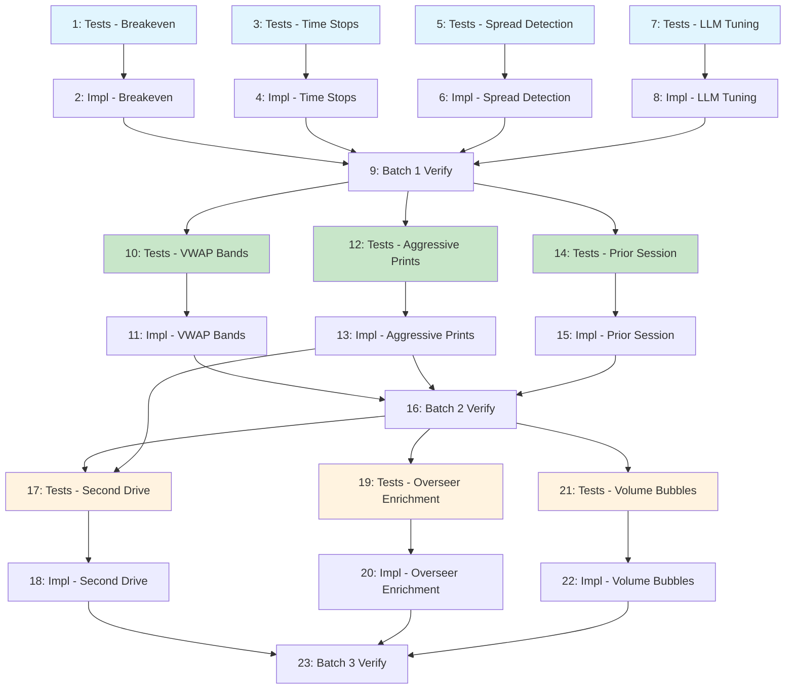

# Implementation Plan: GlassyTrade AI v5 Improvements

## Batch 1: Defense (Independent, all SMALL)

Items: [1] Breakeven at 1R, [3] Session-Aware Time Stops, [7] Spread Detection, [10] LLM Tuning

---

- [x] 1. Write tests for Breakeven at 1R / CVD-Based
  - Add tests to `backend/tests/unit/domain/test_trade_manager.py`
  - Test: position reaches 1R unrealised profit -> SL moves to entry price
  - Test: CVD confirms direction within 1 candle -> SL moves to entry
  - Test: SL never moves below entry once `breakeven_set=True`
  - Test: partial TP still fires at correct distance (no regression)
  - Test: trailing activates at 1R, not 50% TP
  - Test: tight SL with wide spread edge case
  - Test: CVD fires, next candle doji -> position holds at BE
  - _Requirements: 1.1, 1.2, 1.3, 1.4, 1.5_

- [x] 2. Implement Breakeven at 1R / CVD-Based
  - Add `breakeven_at_1r`, `cvd_breakeven`, `trail_activation_r` to `TradeManagerConfig` in `backend/app/domain/fabio_ai/services/trade_manager.py`
  - Add `breakeven_set`, `entry_cvd_direction` fields to `ManagedPosition`
  - Add `apply_cvd_breakeven(position_id, cvd_slope)` method
  - Modify `check_position()`: insert 1R breakeven check after SL check, before partial TP; update trailing to use 1R activation
  - Modify `backend/app/application/handlers/trade_lifecycle_handler.py` to call `apply_cvd_breakeven` with CVD data from AMTResult
  - Wire CVD slope through `backend/app/api/websocket/gameloop.py` if not already available
  - _Requirements: 1.1, 1.2, 1.3, 1.4, 1.5_

- [x] 3. Write tests for Session-Aware Time Stops
  - Add tests to `backend/tests/unit/domain/test_trade_manager.py` and `backend/tests/unit/domain/test_session_context.py`
  - Test: morning balanced -> 1200s
  - Test: afternoon imbalanced -> 1800s
  - Test: expiry day balanced -> 600s
  - Test: enter at 14:55, close at 15:15 -> min(phase_stop, time_to_close - 300)
  - Test: BALANCED -> IMBALANCED mid-trade -> time stop extends, never shrinks
  - Test: no session data -> fallback 1800/7200
  - Test: `is_expiry_day()` and `seconds_to_close()` helpers
  - _Requirements: 10.1, 10.2, 10.3, 10.4_

- [x] 4. Implement Session-Aware Time Stops
  - Add `session_phase`, `is_expiry_day`, `time_to_close`, `applied_time_stop` to `ManagedPosition` in `backend/app/domain/fabio_ai/services/trade_manager.py`
  - Add `get_session_time_stop(market_state, session_phase, is_expiry, time_to_close_seconds)` method
  - Modify `check_position()` time stop section to use session-aware lookup with `max(applied_time_stop, new_stop)` logic
  - Add `is_expiry_day(date)` and `seconds_to_close(timestamp, market)` to `backend/app/domain/fabio_ai/services/session_context.py`
  - Pass session context through `backend/app/application/handlers/trade_lifecycle_handler.py` and `backend/app/api/websocket/gameloop.py`
  - _Requirements: 10.1, 10.2, 10.3, 10.4_

- [x] 5. Write tests for Spread Blowout Detection
  - Add tests to `backend/tests/unit/domain/test_trade_manager.py`
  - Test: spread < 3% -> no exit
  - Test: spread >= 3% -> SPREAD_BLOWOUT exit
  - Test: no order book data -> skip check, no crash
  - Test: ExitReason.SPREAD_BLOWOUT tracked correctly
  - Test: spread exactly at 3% threshold
  - _Requirements: 7 (from design Item 7)_

- [x] 6. Implement Spread Blowout Detection
  - Add `SPREAD_BLOWOUT` to ExitReason in `backend/app/domain/fabio_ai/services/trade_manager.py`
  - Add `check_spread_blowout(position_id, best_bid, best_ask, premium, max_spread_pct=0.03)` method
  - Call from `backend/app/application/handlers/trade_lifecycle_handler.py` in `check_exits()` before other checks
  - Pass order book bid/ask from `backend/app/api/websocket/gameloop.py`
  - _Requirements: 7 (from design Item 7)_

- [x] 7. Write tests for LLM Instruction and Temperature Tuning
  - Add tests to `backend/tests/unit/domain/test_config.py` (new file if needed)
  - Test: entry uses temperature 0.4
  - Test: overseer uses temperature 0.3
  - Test: env var override works
  - Test: instruction text matches new wording
  - _Requirements: 9.1, 9.2, 9.3, 9.4_

- [x] 8. Implement LLM Instruction and Temperature Tuning
  - Update `LLM_INSTRUCTION` in `backend/app/config.py` to AMT practitioner framing
  - Add `LLM_ENTRY_TEMPERATURE=0.4` and `LLM_OVERSEER_TEMPERATURE=0.3` with env var support
  - Update `backend/app/infrastructure/adapters/mlx_inference_adapter.py` to accept temperature parameter
  - Update `backend/app/application/handlers/llm_overseer_handler.py` to pass overseer temperature
  - Update entry handler to pass entry temperature
  - _Requirements: 9.1, 9.2, 9.3, 9.4_

- [x] 9. Batch 1 verification: run full test suite
  - Run `pytest backend/tests/` — all 368+ existing tests pass, plus ~23 new tests
  - Verify no regressions
  - _Requirements: NF-1, NF-2_

---

## Batch 2: Entry Quality + Data Plumbing

Items: [4] VWAP Bands, [6] Aggressive Prints as Structural Levels, [9] Prior Session Data Flow

---

- [x] 10. Write tests for VWAP Bands bias and trailing
  - Add tests to `backend/tests/unit/domain/test_entry_gate.py` and `backend/tests/unit/domain/test_trade_manager.py`
  - Test: LONG below VWAP -> warning flag
  - Test: SHORT above VWAP -> warning flag
  - Test: price at VWAP+2sigma LONG entry -> confidence downgraded
  - Test: at 1.5R profit -> SL moved to nearest VWAP band
  - Test: at 2 sigma overextension -> SL tightened to 50%
  - Test: high-vol wide bands -> trail capped at 1.5R
  - _Requirements: 4.1, 4.2, 4.3, 4.4, 4.5_

- [x] 11. Implement VWAP Bands bias and trailing
  - Add `check_vwap_bias(direction, price, vwap, vwap_upper_2, vwap_lower_2)` to `backend/app/domain/fabio_ai/services/entry_gate.py`
  - Add `apply_vwap_trail(position_id, current_price, vwap, bands...)` to `backend/app/domain/fabio_ai/services/trade_manager.py`
  - Wire `check_vwap_bias()` into grading in `backend/app/application/handlers/llm_entry_handler.py`
  - Wire `apply_vwap_trail()` into `backend/app/application/handlers/trade_lifecycle_handler.py` per-tick
  - _Requirements: 4.1, 4.2, 4.3, 4.4, 4.5_

- [x] 12. Write tests for Aggressive Prints as Structural Levels
  - Add tests to `backend/tests/unit/domain/test_entry_gate.py`
  - Test: `cluster_aggressive_prints()` merges prints within 0.1%
  - Test: `three_align_check()` recognizes price near aggressive print as "near level"
  - Test: existing near-level checks still work (VAH/VAL/POC/HVN/LVN)
  - Test: prints older than 30 candles excluded
  - Test: cap at top 5 by volume
  - _Requirements: 5.1, 5.2, 5.3, 5.4, 5.5_

- [x] 13. Implement Aggressive Prints as Structural Levels
  - Add `cluster_aggressive_prints(prints, cluster_pct=0.001)` to `backend/app/domain/fabio_ai/services/entry_gate.py`
  - Add `aggressive_levels` parameter to `three_align_check()` and include in near-level search loop
  - Compute clustered levels in `backend/app/application/handlers/llm_entry_handler.py` and pass to gate
  - Pass through `backend/app/api/websocket/gameloop.py`
  - _Requirements: 5.1, 5.2, 5.3, 5.4, 5.5_

- [x] 14. Write tests for Prior Session Data Flow
  - Add tests to `backend/tests/unit/infrastructure/test_storage.py` (new or extend) and `backend/tests/unit/domain/test_session_context.py`
  - Test: `save_session_profile` persists to DB
  - Test: `load_prior_session_profile` returns most recent entry
  - Test: gap_type computed correctly (SMALL/MEDIUM/LARGE)
  - Test: opening_bias computed correctly
  - Test: no prior data -> empty fields, no crash
  - Test: full cycle: save -> load -> AMTResult populated
  - _Requirements: 6.1, 6.2, 6.3, 6.4, 6.5_

- [x] 15. Implement Prior Session Data Flow
  - Add `save_session_profile()` and `load_prior_session_profile()` to `backend/app/domain/ports/storage.py` (StoragePort ABC)
  - Implement in `backend/app/infrastructure/storage/database.py` (new `session_profiles` table)
  - Save at session close in `backend/app/api/websocket/gameloop.py`
  - Load at session open, store in `backend/app/application/services/trading_session.py` as `_prior_profile`
  - Wire into `backend/app/domain/fabio_ai/services/amt_analyzer.py` to populate `prior_poc`, `prior_vah`, `prior_val`, `gap_type`, `opening_bias` in AMTResult
  - _Requirements: 6.1, 6.2, 6.3, 6.4, 6.5_

- [x] 16. Batch 2 verification: run full test suite
  - Run `pytest backend/tests/` — all existing + Batch 1 tests pass, plus ~17 new tests
  - Verify no regressions
  - _Requirements: NF-1, NF-2_

---

## Batch 3: Structural Changes (Build on Batch 2)

Items: [2] Second Drive Enforcement, [5] Overseer Context Enrichment, [8] Volume Bubble Integration

---

- [x] 17. Write tests for Second Drive Enforcement
  - Create `backend/tests/unit/domain/test_level_tracker.py` (new file)
  - Add grading tests to `backend/tests/unit/application/test_llm_entry_handler.py`
  - Test: first touch -> status "FIRST_TOUCH"
  - Test: price leaves by 1 ATR, returns -> "SECOND_DRIVE"
  - Test: 3 touches -> "EXHAUSTED"
  - Test: grade_score modification (+2, -1, -2)
  - Test: proximity zone uses 0.3% of price
  - Test: `clear_intraday()` resets touches, keeps level registrations
  - Test: retest 5 ticks below original within proximity counts
  - _Requirements: 3.1, 3.2, 3.3, 3.4, 3.5, 3.6_

- [x] 18. Implement Second Drive Enforcement
  - Create `backend/app/domain/fabio_ai/services/level_tracker.py` with `LevelTracker` class (`TrackedLevel`, `update()`, `register_levels()`, `get_level_status()`, `clear_intraday()`)
  - Inject into `backend/app/application/handlers/llm_entry_handler.py`, add grade_score adjustments
  - Instantiate in `backend/app/api/websocket/gameloop.py`, call `update()` per tick, `register_levels()` after AMT
  - Hold instance in `backend/app/application/services/trading_session.py`
  - _Requirements: 3.1, 3.2, 3.3, 3.4, 3.5, 3.6_

- [x] 19. Write tests for Overseer Context Enrichment
  - Add tests to `backend/tests/unit/domain/test_prompt_builder.py`
  - Test: prompt includes session phase when provided
  - Test: prompt includes profile shape from AMTResult
  - Test: prompt includes OI/PCR when provided
  - Test: prompt includes LVN play signal
  - Test: prompt includes stacked imbalances from footprint
  - Test: each source missing -> prompt still valid, no crash
  - _Requirements: 7.1, 7.2, 7.3, 7.4, 7.5, 7.6_

- [x] 20. Implement Overseer Context Enrichment
  - Extend `build_overseer_prompt()` signature in `backend/app/domain/fabio_ai/services/prompt_builder.py` to accept `session_info`, `footprint_candle`, `oi_analysis`
  - Append session phase, profile shape, OI/PCR, LVN play, stacked imbalances sections (1 line each, skip if None)
  - Pass new data from `backend/app/application/handlers/llm_overseer_handler.py`
  - _Requirements: 7.1, 7.2, 7.3, 7.4, 7.5, 7.6_

- [x] 21. Write tests for Volume Bubble Integration
  - Add tests to `backend/tests/unit/domain/test_entry_gate.py`, `backend/tests/unit/domain/test_trade_manager.py`, `backend/tests/unit/domain/test_prompt_builder.py`
  - Test: aligned imbalances -> +1 grade_score
  - Test: opposing imbalances -> -2 grade_score
  - Test: opposing on open position -> SL tightened
  - Test: no imbalance data -> no effect, no crash
  - Test: overseer prompt includes imbalances text
  - Test: many imbalances both directions -> net effect
  - _Requirements: 8.1, 8.2, 8.3, 8.4, 8.5, 8.6_

- [x] 22. Implement Volume Bubble Integration
  - Add `StackedImbalance` dataclass to `backend/app/domain/trading/models/value_objects.py`
  - Add extraction method to `backend/app/domain/fabio_ai/services/footprint_analyzer.py`
  - Add `check_imbalance_alignment(direction, imbalances)` to `backend/app/domain/fabio_ai/services/entry_gate.py`
  - Add `check_imbalance_tighten(position_id, imbalances, current_price)` to `backend/app/domain/fabio_ai/services/trade_manager.py`
  - Include imbalances in overseer prompt in `backend/app/domain/fabio_ai/services/prompt_builder.py`
  - Wire into grading in `backend/app/application/handlers/llm_entry_handler.py`
  - Wire tighten into `backend/app/application/handlers/trade_lifecycle_handler.py`
  - Propagate from `backend/app/api/websocket/gameloop.py`
  - _Requirements: 8.1, 8.2, 8.3, 8.4, 8.5, 8.6_

- [x] 23. Batch 3 verification: run full test suite
  - Run `pytest backend/tests/` — all existing + Batch 1 + Batch 2 tests pass, plus ~19 new tests
  - Verify no regressions, total ~59 new tests across all batches
  - _Requirements: NF-1, NF-2_

---

## Tasks Dependency Diagram

